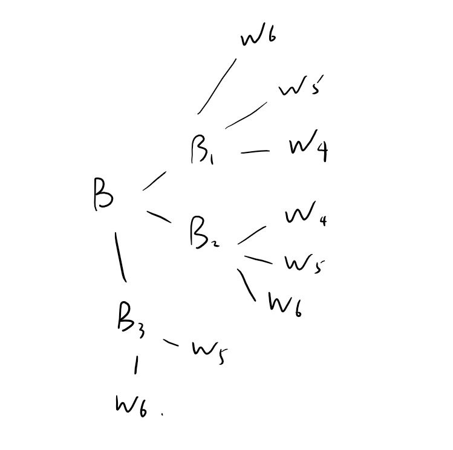

```{r message=FALSE}
library(rethinking)
```

# 2E1
The answer is (2)

# 2E2
The answer is (3)

# 2E3
The answer is (1)

# 2E4
Frequentists approach link probability with the frequency of events in very large numbers. In this view, parameters and models cannot have probability distributions, only measurement can. Frequentist uncertainty being premised on imaginary resampling of data -- if we were to repeat the measurement many many times, we would end up collecting a list of values that will have some pattern to it. 

For Bayesian data analysis, probability is nothing more than a smart way of counting the number of ways that the data could happen. This allow us to see probability as a general way to represent plausibility. 

So in this scenario, "the probability of water is 0.7" means that due to our lack of information, we cannot predict the outcome of trials. This is a generalized way to summarize the uncertainty. 

# 2M1
```{r}
# define the grid
p_grid <- seq(0,1,length.out=1000)

# compute the prior at each grid point
# p ~ unif(0,1)
# W ~ bino(N,p)
p <- rep(1,1000)
W <- dbinom(5, 7, prob=p_grid)

# now compute the likelihood
posterior_raw <- p * W
posterior <- posterior_raw / sum(posterior_raw)

# then sample the posterior
samples <- sample(p_grid, size=1e4, replace = TRUE, prob = posterior)

dens(samples)

```


# 2M2
```{r}

# define the grid
p_grid <- seq(0,1,length.out=1000)

# compute the prior at each grid point
# p ~ unif(0,1)
# W ~ bino(N,p)
p <- ifelse(p_grid < 0.5, 0, 2)
W <- dbinom(3, 3, prob=p_grid)

# now compute the likelihood
posterior_raw <- p * W
posterior <- posterior_raw / sum(posterior_raw)

# then sample the posterior
samples <- sample(p_grid, size=1e4, replace = TRUE, prob = posterior)

dens(samples)

```

# 2M3

First, we compute $Pr(land)$: 

$$Pr(land) = Pr(land|earth)Pr(earth) + Pr(land | mars)Pr(mars) = (0.3)(0.5) + (1)(0.5) = 0.65$$

Then, we can apply Bayes' Theorem to calculate the probability of Earth given that the toss is land

$$Pr(Earth | land) = \frac{Pr(Earth\cap land)}{Pr(land)} = \frac{Pr(land|earth) Pr(earth)}{Pr(land)} = \frac{0.3\times0.5}{0.65}=0.23$$

# 2M4

We label the cards as the following: 

B1, B2;
B3, W4;
W5, W6;

where each row represents two sides of one card. B means black, and W means white.

Now, we count up all possible ways that we see a black card: 

                    
See a black side up means it is either:
1. B1
2. B2
3. B3

and the other side could be 
1. B2
2. B1
3. W4

Hence the possibility of the other side being black is $\frac{2}{3}$


# 2M5
Using similar method, the probability is $\frac{4}{5}$

But here we can also use Bayesian updates. TODO

# 2M6

Now, considering there are uneven possibilities, we need a notation system that can reflect the change. Namely, for this problem we will deploy the following notations:

$B_{1,1}, B_{2,1}$;
$B_{3,1}, W_{3,1}$;
$B_{3,2}, W_{3,2}$

That is, again, each row are two sides of one card, except now there is an additional subscript that represent the uneven chance. For instance, $B_{3,1}$ is the first way to pull the black side of second card up, and $B_{3,2}$ is the second way to pull the black side up. 

Hence, we count all the possible ways that we pull a black side up: 

1. $B_{1,1}$ 
2. $B_{2,1}$
3. $B_{3,1}$
4. $B_{3,2}$

and the corresponding sides are:

1. $B_{2,1}$
2. $B_{1,1}$
3. $W_{3,1}$
4. $W_{3,2}$

Hence the probability of seeing a black is $\frac{1}{2}$

# 2M7

We can think back to the "garden of forking path" example. That is, we treat two consecutive sequences as one path. And the following graph can illustrate all the possibilities: 



And if we count all the possibilities, there are total of 8 possibilities, and in 6 of the paths, the first draw has black on the other sides. Hence the probability is $\frac{3}{4}$

# 2H1

For this problem, we first need to find the posterior distribution using Bayesian updates. The process can be verified using standard probability procedure, but I will present a Bayesian version here:

Pandas  | Prior | Likelihood | posterior(raw)| posterior(std)
--------|-------|------------|---------------|-------------------
A       | 0.5   | 0.1        |      0.05     |  $\frac{1}{3}$
B       | 0.5   | 0.2        |      0.1      |  $\frac{2}{3}$

Knowing the posterior probability, we can then calculate the probability of next panda babies being a twin: 

$$Pr(twin) = Pr(twin | A) \cdot Pr(A | twin) + Pr(twin|B) \cdot Pr(B|twin) = (0.1)(\frac{1}{3}) + (0.2)(\frac{2}{3}) = \frac{1}{6} $$

# 2H2

By the previous problem, we have already calculated that the posterior probability is $\frac{1}{3}$

# 2H3
We just need to carry one more Bayesian update to use our previous posterior as our prior, and find the new posterior probability: 


Pandas  |     Prior       | Likelihood | posterior(raw)| posterior(std)
--------|-----------------|------------|---------------|--------------
A       | $\frac{1}{3}$   | 0.9        |$\frac{3}{10}$ |       0.36
B       | $\frac{2}{3}$   | 0.8        |$\frac{8}{15}$ |       0.64


# 2H4

Define $test$ to be the result of the test that is issued.
In order to apply Bayes' Theorem, we need to figure out $Pr(test=A)$: 

$$
\begin{align*}

Pr(test=A) &= Pr(test=A | A)\cdot Pr(A) + Pr(test=A | B) \cdot Pr(B)\\
&= Pr(test=A | A)\cdot Pr(A) + (1-Pr(test=B | B)) \cdot Pr(B)\\
&= (0.8)(0.5) + (1-0.65)(0.5) \\ 
&= 0.575
\end{align*}
$$

By Bayes' Theorem, 
$$
\begin{align*}
Pr(A | test=A) &= \frac{P(test=A | A) \cdot Pr(A)}{P(test=A)} \\
               &= \frac{0.8\times0.5}{0.575} \approx 0.696
\end{align*}
$$

Now we incorporate the birth data along with the test result (assuming that we are using the twin and then single data): 


Pandas  |     Prior       | Likelihood | posterior(raw)| posterior(std)
--------|-----------------|------------|---------------|--------------
A       | 0.36            | 0.8        | 0.288         |      0.5625
B       | 0.64            | 0.35       | 0.224         |      0.4375

I really like Anders Gocalves da Silva's plot to summarize this problem, so I will do the same thing here 

```{r message=FALSE}
library(tidyverse)
```

```{r}
prob <- c(0.5, 0.5, 0.33, 0.67,0.36, 0.64, 0.5625, 0.4375 )
type <- rep(c("A", "B"), 4)
level <- c("Prior", "Prior", "Twin", "Twin", "Twin + Single", "Twin + Single", "Twin + Single + Test=A", "Twin + Single + Test=A")
df <- tibble(prob=prob, type=type, level=level)
ggplot(data=df, aes(level, prob, col=type, group=type)) + 
  geom_point() + 
  geom_line()
```


